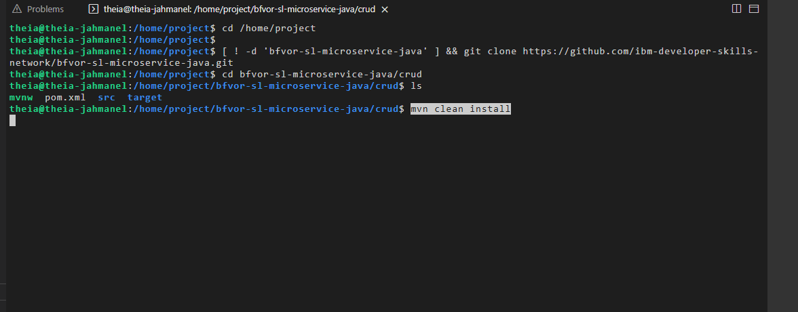
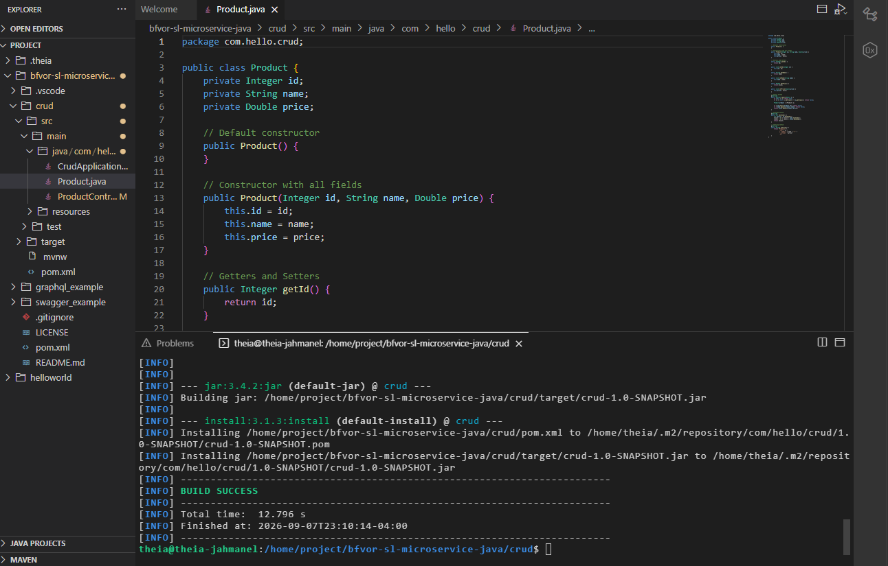
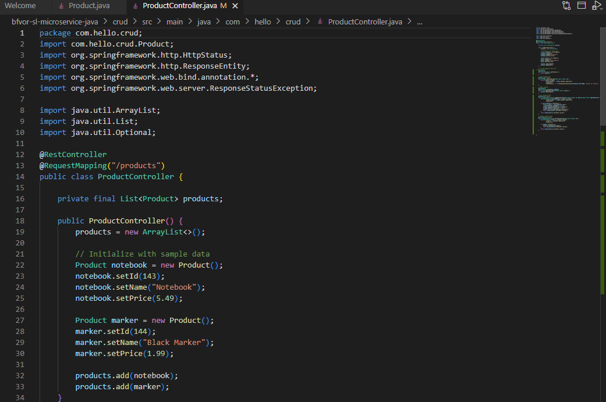
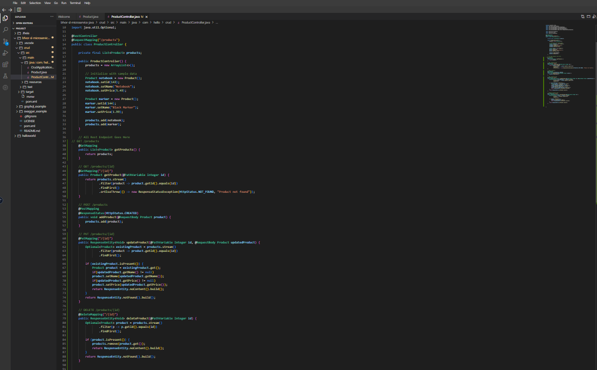
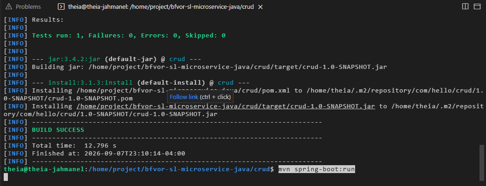
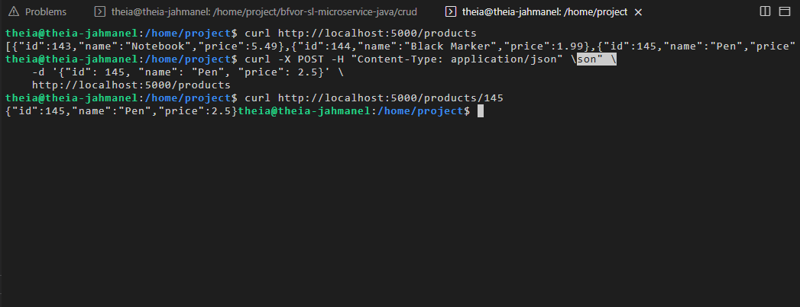
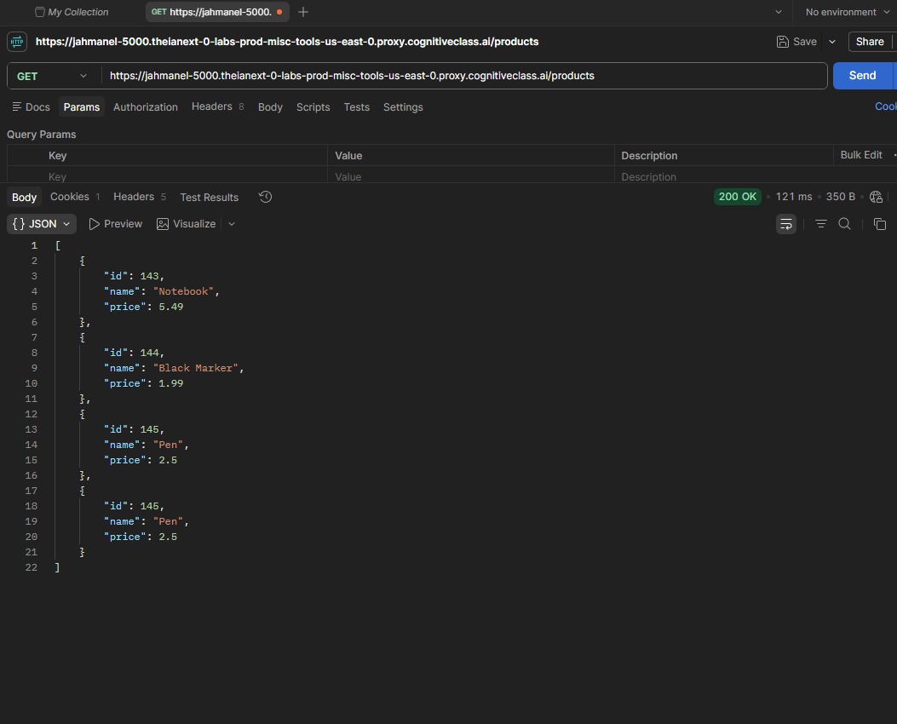
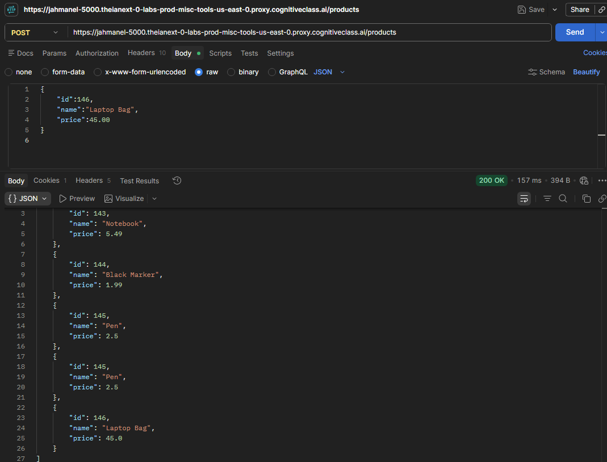
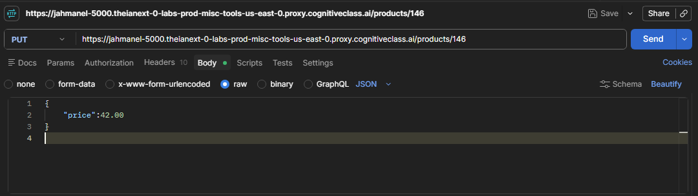
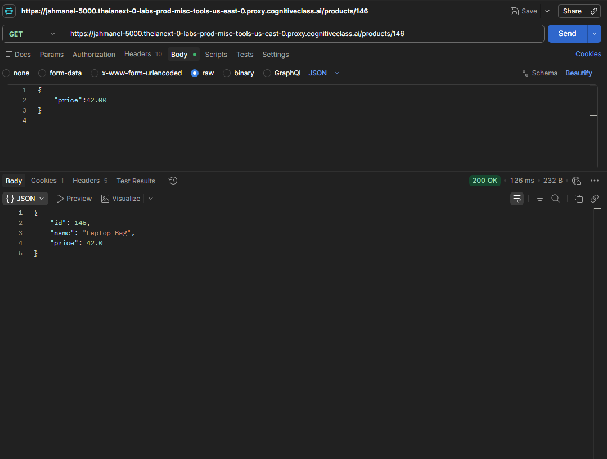

# Product CRUD REST API — Spring Boot

A hands-on project completed as part of IBM's **Cloud Native, Microservices, Containers, DevOps and Agile** course (part of the [IBM Hybrid Cloud Architect Professional Certificate](https://www.coursera.org/professional-certificates/ibm-hybrid-cloud-architect) on Coursera).

## What this project demonstrates

A REST API built with **Java and Spring Boot** that implements full **CRUD (Create, Retrieve, Update, Delete)** operations on an in-memory product list. This project covers:

- Designing a data model class (`Product`) with proper encapsulation, `equals()`, `hashCode()`, and `toString()` overrides
- Building a REST controller (`ProductController`) that exposes CRUD endpoints following REST conventions
- Correct use of HTTP methods and status codes (`200`, `201 Created`, `204 No Content`, `404 Not Found`)
- Testing endpoints using both **cURL** (command line) and **Postman** (GUI API client)

> **Note:** Product data is stored in-memory (a Java `ArrayList`) for this exercise — there is no persistent database layer. This project's focus is REST API design and CRUD logic, not data persistence.

## API Endpoints

| Method | Endpoint | Description |
|---|---|---|
| `GET` | `/products` | Retrieve all products |
| `GET` | `/products/{id}` | Retrieve a single product by ID |
| `POST` | `/products` | Create a new product |
| `PUT` | `/products/{id}` | Update an existing product's fields (partial updates supported) |
| `DELETE` | `/products/{id}` | Delete a product by ID |

## How it was built and tested

**1. Cloned the project scaffold and built it with Maven**
```bash
git clone https://github.com/ibm-developer-skills-network/bfvor-sl-microservice-java.git
cd bfvor-sl-microservice-java/crud
mvn clean install
```

**2. Defined the `Product` model** with `id`, `name`, and `price` fields, a default and full constructor, getters/setters, and overridden `equals()`, `hashCode()`, and `toString()` methods. See [`app/src/main/java/com/hello/crud/Product.java`](./app/src/main/java/com/hello/crud/Product.java).

**3. Implemented the `ProductController`** with all five CRUD endpoints, using Java Streams to filter and locate products by ID, and proper HTTP status responses for success and not-found cases. See [`app/src/main/java/com/hello/crud/ProductController.java`](./app/src/main/java/com/hello/crud/ProductController.java).

**4. Ran the test suite and started the application**
```bash
mvn spring-boot:run
```

**5. Tested endpoints with cURL**
```bash
curl http://localhost:5000/products

curl -X POST -H "Content-Type: application/json" \
  -d '{"id": 145, "name": "Pen", "price": 2.5}' \
  http://localhost:5000/products

curl http://localhost:5000/products/145
```

**6. Tested endpoints with Postman**, verifying GET (all products and by ID), POST (creating a new product), and PUT (updating an existing product's price) against the live running application.

## Screenshots

| Step | Screenshot |
|---|---|
| Cloning and building the project |  |
| Build success & Product model |  |
| Initial ProductController with sample data |  |
| Full CRUD endpoints implemented |  |
| Tests passing, application running |  |
| Testing GET & POST via cURL |  |
| Postman: GET all products |  |
| Postman: POST a new product |  |
| Postman: PUT update a product |  |
| Postman: GET verifying the update |  |

## Tech used

`Java` · `Spring Boot` · `Maven` · `REST API design` · `cURL` · `Postman`

## Credit

Project scaffold provided by [IBM Developer Skills Network](https://github.com/ibm-developer-skills-network/bfvor-sl-microservice-java). The `Product` model, `ProductController` REST endpoints, and all CRUD logic were implemented by me as part of this lab.

---

*Elijah Cordova — working toward a DevOps/Cloud Engineering role. Part of my progress through the [IBM Hybrid Cloud Architect Professional Certificate](https://www.coursera.org/professional-certificates/ibm-hybrid-cloud-architect).*
